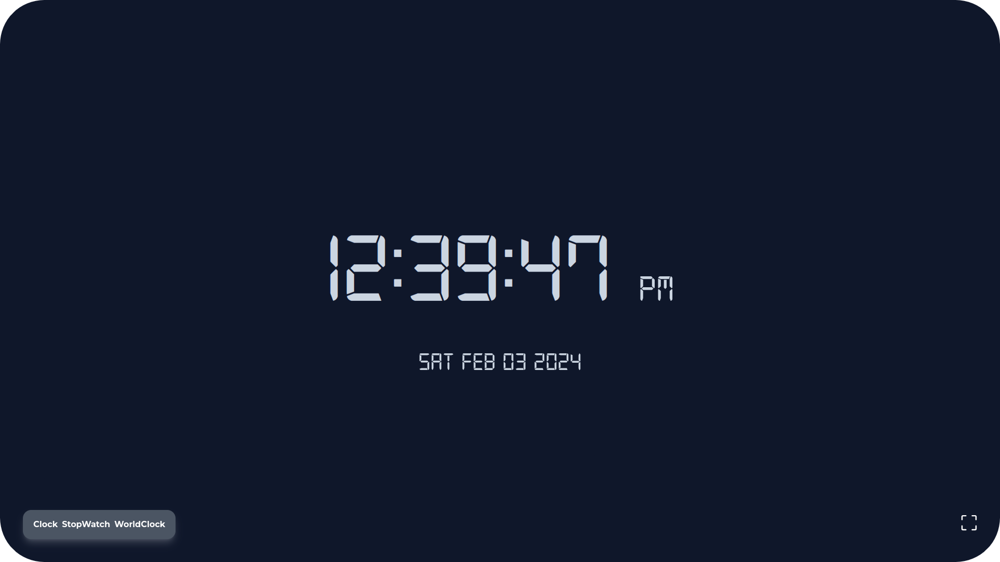

# BASIC CLOCK APP

   

Welcome to the Clock App repository!

<h3 align="left">Technologies:</h3>
<p align="left"> <a href="https://www.w3schools.com/css/" target="_blank" rel="noreferrer" style="text-decoration: none !important;"></a>
</a>
  <a href="https://www.w3.org/html/" target="_blank" rel="noreferrer" style="text-decoration: none !important;">
    </a>
    <a href="https://developer.mozilla.org/en-US/docs/Web/JavaScript" target="_blank" rel="noreferrer"style="text-decoration: none !important;">
      </a>
      <a href="https://reactjs.org/" target="_blank" rel="noreferrer"style="text-decoration: none !important;">
        </a> 
       <a href="https://www.typescriptlang.org/" target="_blank" rel="noreferrer"style="text-decoration: none !important;">
        </a>
       <a href="https://tailwindcss.com/" target="_blank" rel="noreferrer"style="text-decoration: none !important;">
        </a>
       <a href="https://redux.js.org/" target="_blank" rel="noreferrer"style="text-decoration: none !important;">
        </a>
        </p>

## Overview

This repository contains the source code for a simple Clock App built using ReactJS. The app displays the current time and allows users to customize the clock format.

## Features
The repository could showcase various features, such as:

> - [ ] Responsive Design
> - [ ] Active class for page
> - [ ] Onclick Copy Emoji
> - [ ] IOS Emojis
> - [ ] Check IOS Emoji Exist In CDN SERVER
> - [ ] Search Bar
> - [ ] Pagination Bar
> - [ ] Title For Emojis
> - [ ] Emoji API & CDN
> - [ ] Shake Images (IOS Emoji) On Hover
> - [ ] Onclick () => Clear Search Input Value
> - [ ] ToolTop For Hover & Show: "Click To Copy Emoji"
> - [ ] Loader Component
> - [ ] OnError IOS Emoji, Show System Emojis
> - [ ] No Drag For Images
> - [ ] Router Paes
> - [ ] WPA
> - [ ] Toggle Dark OR Light Mode
> - [ ] Float Icons For Starter Page
> - [ ] Easy, Medium, Expert, Master, Mode For Game


.


### Key Features

- **Real-Time Clock:** The app displays the current time in a user-friendly format.

- **Responsive Design:** The app is built with responsiveness in mind, ensuring a seamless experience across various devices.

- **User Interaction:** Handling user interactions for format customization.

- **Built with ReactJS:** Leveraging the power of ReactJS, this timer component is efficient, maintainable, and easy to integrate into your React projects.

## Screenshots




## Run Locally

Clone the project

```bash
  git clone https://github.com/amirrahemi01/basic-clock-reactjs
```

Go to the project directory

```bash
  cd basic-clock-reactjs
```

Install dependencies

```bash
  npm install
```

Start the server

```bash
  npm run start
```

## License

This project is licensed under the MIT License. See the [LICENSE](LICENSE.txt) file for more details.

## License


## Demo


Check Demo <a href="https://amirrahemi-emoji.vercel.app/" target="_blank">DEMO</a>
